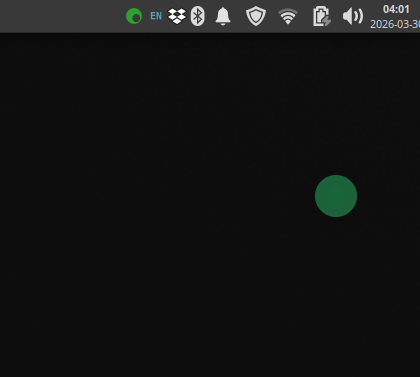
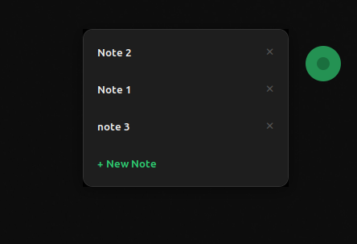
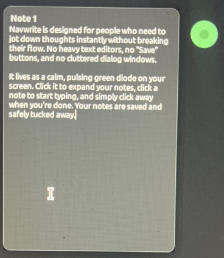

# NavWrite

<p align="center">
  
</p>

<p align="center">
  <b>A fast, floating, distraction-free scratchpad for Linux.</b>
</p>

<p align="center">
  <a href="#features">Features</a> •
  <a href="#installation">Installation</a> •
  <a href="#usage">Usage</a> •
  <a href="#uninstallation">Uninstall</a>
</p>

---

## The Idea

NavWrite is built for one thing: **capturing thoughts instantly without breaking flow**.

No windows. No save buttons. No friction.

It lives quietly on your screen as a pulsing green hub.
Click it, type, and move on. Your notes are saved automatically and disappear the moment you’re done.

---

## Preview

<p align="center">
  
</p>

<p align="center">
  
</p>

---

## Features

### Instant, Ephemeral Notes

Open → type → leave.
NavWrite auto-saves every keystroke and closes when you click away.

<p align="center">
  
</p>

---

### Floating Hub

A minimal, always-on-top control point:

* draggable anywhere
* subtle pulse animation
* always accessible, never intrusive

---

### Smart Sync (Dropbox)

If a Dropbox folder is detected, your notes sync automatically across devices.

No setup. No friction.

---

### System Tray Control

* hide the hub for deep focus
* quick access to controls
* clean exit anytime

---

## Installation

NavWrite is distributed as a ready-to-use binary.

### Steps

1. Download the latest release or clone this repository
2. Open a terminal in the project folder
3. Run:

```bash
chmod +x install.sh
./install.sh
```

4. Launch **NavWrite** from your applications menu

---

## Usage

### Move the Hub

Click and drag the green circle anywhere on your screen.

### Open Notes

Click the hub to reveal recent notes.

### Create or Edit

Select a note or create a new one.
Start typing immediately.

### Done

Click anywhere outside.
NavWrite saves and closes automatically.

---

## Uninstallation

Remove NavWrite with:

```bash
rm ~/.local/bin/navwrite
rm ~/.local/share/applications/navwrite.desktop
rm ~/.local/share/icons/navwriter.png

update-desktop-database ~/.local/share/applications 2>/dev/null
```

Your notes remain safe in:

* `~/navwrite`
* or `~/Dropbox/navwrite`

---

## Philosophy

NavWrite is not a note-taking app.

It is a **thinking surface**.

Designed for:

* speed over features
* flow over structure
* minimal interruption

---

## Roadmap

* multi-note workspace
* note pinning
* quick search
* optional encryption
* plugin system

---

## License

MIT License
